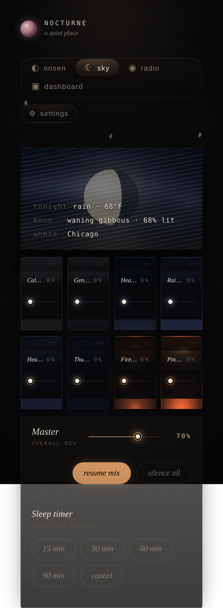
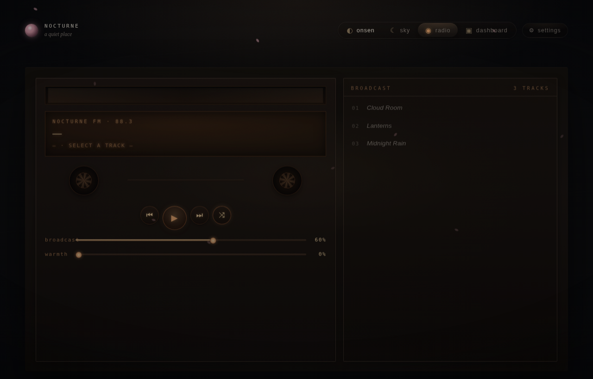

# 🌙 Nocturne

[](LICENSE)


> **Alpha.8 release note:** the public alpha core is **Onsen / Sky / Radio**. Utility and Dashboard remain available as optional full-mode extras, but they are disabled by default.

**A local sleep ritual web app you run yourself.**

Nocturne is a small Python server for a Raspberry Pi, Mac, Windows PC, or Linux box. It serves a bedside web UI over your local network with Onsen rain mixing, a live-weather Sky scene, and a personal tape-deck Radio. No accounts. No cloud. No subscriptions.

<p align="center">
  
</p>

---

## What it is

Nocturne is a **self-hosted web server**, not an app-store mobile app. You run it on a Pi or computer, then open the web UI from a phone, tablet, or laptop on the same trusted LAN.

| Public alpha mode | What it does |
|---|---|
| **Onsen** | Rainy onsen visual plus an 8-channel ambient mixer. |
| **Sky** | Same mixer, but with moon phase, live local weather, reactive clouds/rain/snow/fog, and a weather readout. |
| **Radio** | A tape-deck interface for audio files you drop into `sounds/radio/`, with warmth, slowed-playback Drift, and subtle Space reverb controls. It is a local jukebox, not Spotify or internet radio. |

Optional full-mode extras stay behind Settings:

| Optional mode | Status |
|---|---|
| **Utility** | Strudel sketchbook that saves code under `songs/` and opens strudel.cc for playback. Off by default. |
| **Dashboard** | CRT-style Raspberry Pi terminal/weather dashboard. Off by default in the public alpha profile. |

Nocturne is **offline-tolerant**, not offline-first: the sleep/radio core works after first load, Sky falls back gracefully if weather is unavailable, and weather-backed optional views use Open-Meteo when the network is available.

---

## Gallery

| Sky | Radio |
|---|---|
|  |  |

---

## Quick start

```bash
cd <unzipped-nocturne-folder>
python3 install.py
.venv/bin/python run_nocturne.py
```

Open `http://127.0.0.1:8000/` on the same machine. The launcher prints a copyable ready line:

```text
Nocturne is ready at http://127.0.0.1:8000/
```

`python3 install.py` creates the virtualenv, installs Python dependencies, creates local folders, writes a default config, and generates the procedural starter pack. The pack now has 17 beds: the original `soft-rain-noise.wav`, `window-rain-noise.wav`, `heavy-rain-noise.wav`, `distant-storm-noise.wav` (shown as Soft Pink Rain Noise after alpha.8 audition), `soft-wind-noise.wav` (shown as Soft Air Noise), and pink/brown/white noise; plus `low-rumble-bed.wav`, `distant-train-bed.wav`, `soft-traffic-bed.wav`, `fan-room-bed.wav`, `rain-on-glass-noise.wav`, `deep-water-bed.wav`, `ember-crackle-bed.wav`, and the alpha.8 thunder audition candidates `distant-thunder-bed.wav` and `soft-thunderstorm-bed.wav`. That means Nocturne works immediately before any curated third-party files are installed.

Dependencies use broad minimum version bounds in `requirements.txt` for compatibility across Pi/macOS/Windows/Linux. For a fully reproducible deployment, pin or lock the resolved environment you test.

For phone/tablet access on your trusted LAN, run deliberately with:

```bash
.venv/bin/python run_nocturne.py --host 0.0.0.0 --port 8000
```

Then open:

```text
http://<pi-ip>:8000/
# or
http://<hostname>.local:8000/
```

Use the topbar mode switcher to jump between enabled modes. Click **Settings** to show/hide modes and configure Sky location without editing JSON by hand.

### Alpha feedback build label

For alpha testing, Nocturne exposes a copyable build label in **Settings → Build**, the page footer, and `/api/version`.

Current packaged alpha label:

```text
v0.1.0-alpha.8 · 2026-06-29 · 7c9dba3
```

Before creating a new alpha zip from a Git checkout, stamp the build metadata so feedback includes the version, commit, and commit date:

```bash
python scripts/stamp_build.py --version 0.1.0-alpha.8
```

Use `ALPHA_FEEDBACK.md` as the lightweight tester template.

### Launchers

On Windows:

1. Double-click `Install Nocturne.bat`.
2. Double-click `Start Nocturne.bat`.
3. The browser should open to `http://127.0.0.1:8000/`.

For LAN access from another device, double-click `Start Nocturne LAN.bat` and allow Python through Windows Firewall for **private networks** only.

On macOS, double-click `Install Nocturne.command`. If Gatekeeper blocks it, right-click the file and choose **Open** the first time. If a downloaded zip drops the execute bit, run `chmod +x "Install Nocturne.command"` once.

---

## Settings first

Most first-time configuration should happen in the app:

- **Modes:** show/hide Onsen, Sky, Radio, and optional Utility/Dashboard.
- **Location:** search for a city, use browser location when supported, or enter latitude/longitude manually.
- **Temperature unit:** Fahrenheit or Celsius.

Settings are saved on the server in:

```text
config/nocturne.json
```

`config/nocturne.example.json` is committed as a reference. The live `config/nocturne.json` file is ignored by Git because it is per-device state.

Utility is off by default because it is the only mode that writes user files under `songs/`. When Utility is off, its `/api/songs` routes return `404`, so the sketchbook write surface is hidden as well as removed from the UI.

Dashboard is also off by default in the public alpha profile. Enable it in Settings when you want the full-mode Raspberry Pi terminal/weather screen.

---

## Ambient sound library

The Onsen/Sky mixer now has **eight active slots** backed by a larger local sound library. Each slot can choose a sound and a visual look, so the public alpha stays simple while still carrying the full 29-sound review library.

This alpha bundles **29 total sounds**: 12 verified Freesound CC0 loops plus 17 generated procedural beds. The sound picker separates **recorded** and **generated** entries and includes a preview button so you can audition loops before assigning them to a slot. Generated beds are named honestly as synthetic texture beds — never dressed up as field recordings — so a bed is renamed rather than pretending if its synthesis does not convincingly match the name. The two generated thunder beds are audition candidates, not defaults. Four questionable or unverified candidates were excluded after metadata, source, or audition checks did not match their intended provenance cleanly enough for release.

| Works immediately after `install.py` | Add later by dropping files in |
|---|---|
| Web UI, Settings, Onsen/Sky/Radio core, optional Dashboard/Utility when enabled, 12 bundled CC0 recordings, and 17 generated beds: soft/window/heavy rain noise, soft pink rain noise, soft air noise, dark rain rumble noise, brown/white noise, low rumble bed, distant train bed, soft traffic bed, fan/room bed, rain on glass noise, deep water bed, ember crackle bed, and two thunder audition candidates | Additional user-owned rain/fire/night/water loops in `sounds/library/` plus provenance entries in `sounds/sound_library.json` |

Open Onsen or Sky, click **change sound** on any mixer card, and pick from the local library. Click the small **look** selector on a card to override its animation/color theme without changing the audio.

The manifest lives here:

```text
sounds/sound_library.json
```

A sound entry looks like this:

```json
{
  "id": "window-rain",
  "name": "Window Rain",
  "category": "rain",
  "theme": "mist-rain",
  "src": "/sounds/library/window-rain.mp3",
  "prompt": "Seamless loop of soft rain against a bedroom window at night, no voices, no music."
}
```

Supported visual themes:

```text
mist-rain · garden-rain · distant-storm · mountain-storm · squall · tempest · hearth · ember-noise
```

When you generate the ElevenLabs/Core Pack files, put the final mastered loops in:

```text
sounds/library/
```

Then either edit `sounds/sound_library.json` directly or import a folder automatically:

```bash
python scripts/import_sound_pack.py ~/Downloads/nocturne-core-pack --set-defaults
```

That script copies supported audio files into `sounds/library/`, adds/upserts manifest entries, infers category/theme from filenames, and can make the first eight imported files the default slots.


### Freesound CC0 curation workflow

Nocturne now has a curation-first path for replacing the procedural starter beds with real CC0 field recordings:

```bash
cp audio_sources.template.csv audio_sources.csv
# Put downloaded CC0 candidates in sounds/inbox/ and screenshots in provenance/screenshots/
python scripts/import_sound_pack.py sounds/inbox --metadata-csv audio_sources.csv --generate-credits
```

Useful docs:

- `docs/FREESOUND_CC0_WORKFLOW.md` — exact workflow and folders.
- `docs/FREESOUND_RAIN_STARTER.md` — starter rain candidate board.
- `docs/SOUND_LIBRARY.md` — manifest fields and visual themes.

### Legacy optional Pixabay fetcher

The older fixed ambience filenames are still supported for compatibility:

```text
calming_rain.mp3
gentle_rain.mp3
heavy_rain.mp3
rainstorm.mp3
heavy_storm.mp3
thunder.mp3
fireplace.mp3
pinknoise.wav
```

`fetch_media.py` can still try to populate those legacy files from Pixabay source pages, but it is best-effort and no longer the preferred release path. For a polished alpha, ship your own generated or curated loops in `sounds/library/` instead of asking testers to scrape media.

To inspect the old fixed-file contract, run:

```bash
python3 check_audio_contract.py
```

To try the legacy fetcher manually:

```bash
python scripts/fetch_media.py --init
python scripts/fetch_media.py --yes
```

If optional media fetching fails during install, installation still completes with generated noise.

## Where audio files go

| Path | What it is for | Notes |
|---|---|---|
| `sounds/library/` | Assignable Onsen/Sky ambience library. | Preferred home for generated Core Sound Pack loops. Listed in `sounds/sound_library.json`. |
| `sounds/` | Legacy fixed ambience filenames plus generated noise. | Still supported for compatibility. |
| `sounds/radio/` | Radio mode tracks. | Dynamic personal library; any number of supported files. Refresh the browser after changes. |
| `songs/` | Local Utility mode Strudel sketches. | Only used when Utility is enabled in Settings. |

`python scripts/generate_noise.py` creates 17 WAV beds locally: soft rain noise, window rain noise, heavy rain noise, soft pink rain noise, soft air noise, dark rain rumble noise, brown noise, white noise, low rumble bed, distant train bed, soft traffic bed, fan/room bed, rain on glass noise, deep water bed, ember crackle bed, distant thunder bed, and soft thunderstorm bed. Each is deterministic (seeded NumPy), 44.1 kHz, conservatively normalized, and tail-to-head crossfaded so it loops cleanly. The thunder beds are audition candidates only and are not default slots.

The optional media fetcher only manages the old fixed ambience files in `sounds/`. It does not fetch radio tracks and it does not manage the new sound library manifest.

Radio mode is dynamic. Anything in `sounds/radio/` is served via `/api/radio` and reached at `/sounds/radio/<filename>`. Supported extensions: `mp3 · ogg · m4a · wav · opus · webm · flac`. Filenames become track titles: `night-drive.mp3` → “Night Drive”. Spoken-word or other personal audio uses the same path: drop files into `sounds/radio/`, refresh, and they appear in Radio without code changes.

Personal narration provenance should be tracked separately from CC0 ambience. Use honest notes such as "user-authored text" and "user-owned or user-licensed generated narration." Do not label narration CC0 unless the text, voice/narration output, and license terms are separately proven.

### Radio sound controls

Radio has four deck sliders:

| Control | What it does | Default |
|---|---|---:|
| `broadcast` | Radio volume before the global master. | `60%` |
| `warmth` | Lo-fi lowpass filter, from clear to muffled. | `0%` |
| `drift` | Slows playback from `1.00×` down to `0.75×` and asks the browser to drop pitch with speed for the classic “slowed” sound. | `1.00×` |
| `space` | Adds a short synthetic room/plate reverb around the radio signal. No extra audio asset is required. | `0%` |

All four controls persist in browser `localStorage`. With `drift` and `space` at zero, radio behaves like the original v0.1 deck.

---

## Weather and location

Sky mode pulls current conditions from **Open-Meteo** through a small backend cache so it does not hammer their API. Open-Meteo does not require an API key.

Configure the weather location from **Settings → Location** in the app. Manual latitude/longitude always works. The **Use browser location** button is only a convenience; browsers usually allow it on `localhost` or HTTPS, and may block it from a phone over plain LAN HTTP.

Default fallback location:

```json
{
  "label": "Chicago",
  "latitude": 41.8781,
  "longitude": -87.6298,
  "timezone": "America/Chicago",
  "temperature_unit": "fahrenheit"
}
```

Environment variables are available as fallback defaults before a saved location exists:

| Variable | Default | Notes |
|---|---:|---|
| `NOCTURNE_LAT` | `41.8781` | Latitude |
| `NOCTURNE_LON` | `-87.6298` | Longitude |
| `NOCTURNE_LOCATION_NAME` | `Chicago` | What the readout shows as “where” |
| `NOCTURNE_TIMEZONE` | `America/Chicago` | Open-Meteo timezone |
| `NOCTURNE_TEMPERATURE_UNIT` | `fahrenheit` | `fahrenheit` or `celsius` |
| `NOCTURNE_WEATHER_TTL` | `600` | Seconds the backend caches a result |

If Open-Meteo is unreachable, the API returns the last cached result tagged `stale: true`. If there is no cached result at all, Sky mode falls back to a calm clear-night render with `weather offline` in the readout.

---

## Running as a Raspberry Pi service

Copy or adapt `nocturne.service`, then update paths for your user and checkout location.

Example service command:

```ini
[Service]
WorkingDirectory=/home/<you>/nocturne
ExecStart=/home/<you>/nocturne/.venv/bin/python run_nocturne.py --host 0.0.0.0 --port 8000
Restart=on-failure
```

Direct Uvicorn still works if you prefer it:

```bash
python3 -m uvicorn main:app --host 0.0.0.0 --port 8000
```

After installing the service:

```bash
sudo systemctl daemon-reload
sudo systemctl enable --now nocturne
```

Add optional `Environment=` lines only if you want to change fallback weather defaults outside the Settings UI.

---

## Architecture

The deliberately simple version:

- `main.py` — FastAPI backend, roughly one file of local routes and weather caching.
- `static/index.html` — self-contained frontend; no React, no build step.
- Browser Web Audio API — handles mixing, gain, radio routing, analyser/VU meter, and sleep fade.
- `config/nocturne.json` — local server-side app settings.
- `sounds/library/`, `sounds/`, and `sounds/radio/` — local audio folders.
- `sounds/sound_library.json` — assignable mixer sound manifest.
- `songs/` — local Utility/Strudel sketch files.

No database. No accounts. No frontend build pipeline. The Pi serves files; the browser does the audio work.

---

## Safety and LAN expectations

Nocturne is intended for a trusted home LAN. It does not implement account login or public-internet hardening.

Use `--host 127.0.0.1` for same-machine use. Use `--host 0.0.0.0` only when you deliberately want other devices on your private network to connect.

Do **not** expose Nocturne directly to the public internet.

---

## License

Nocturne source code is released under the [Apache License 2.0](LICENSE).

Generated or curated ambience media should be documented before release. Use `MEDIA_LICENSES.md`, `sounds/sound_library.json`, and any generated receipts to track provenance, prompts, hashes, and license notes for bundled sounds.
