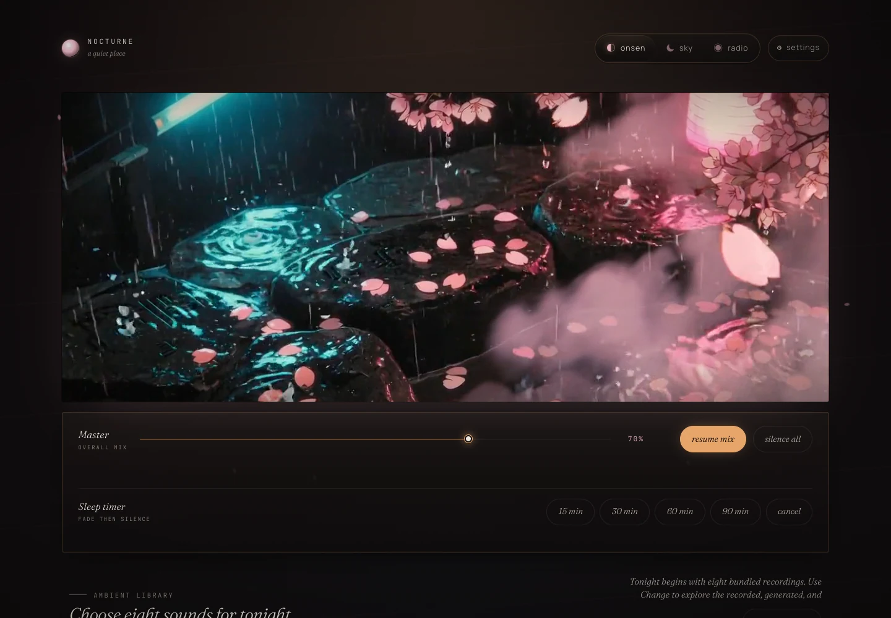
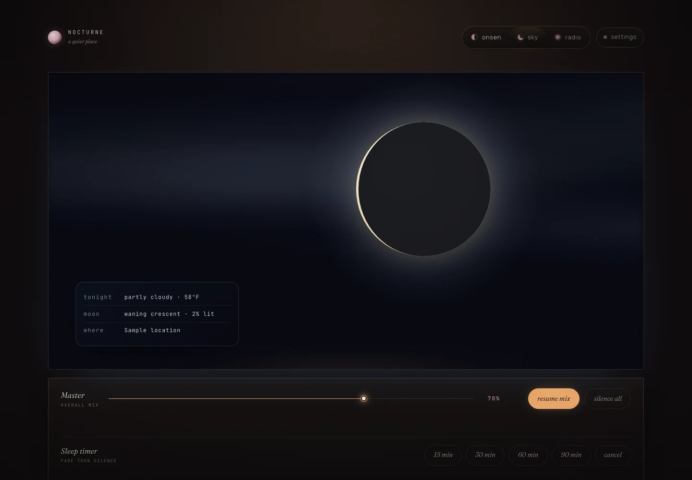
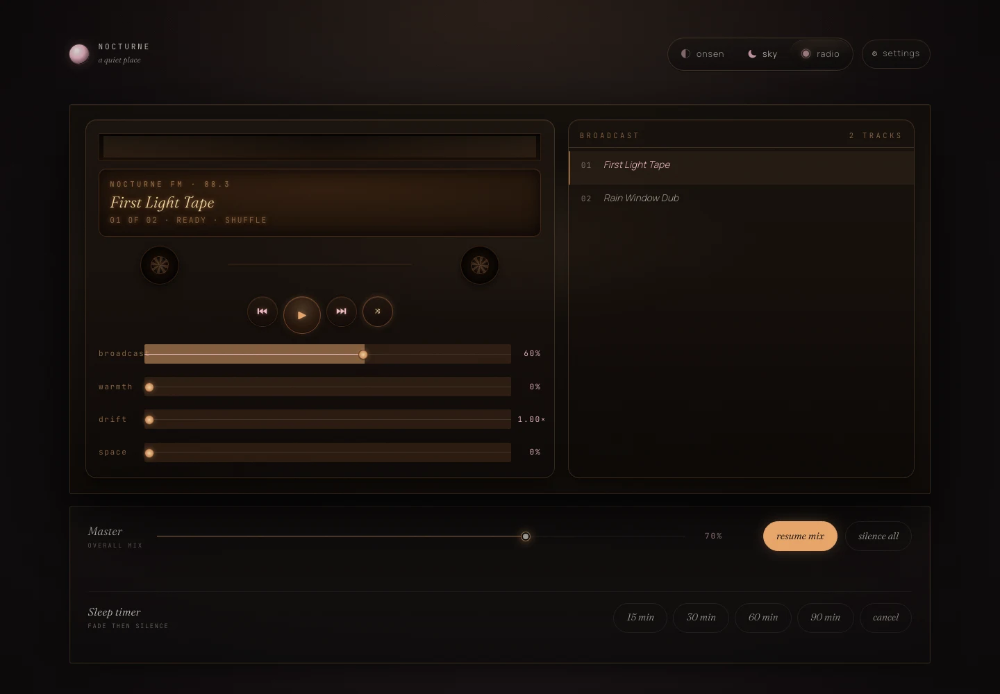
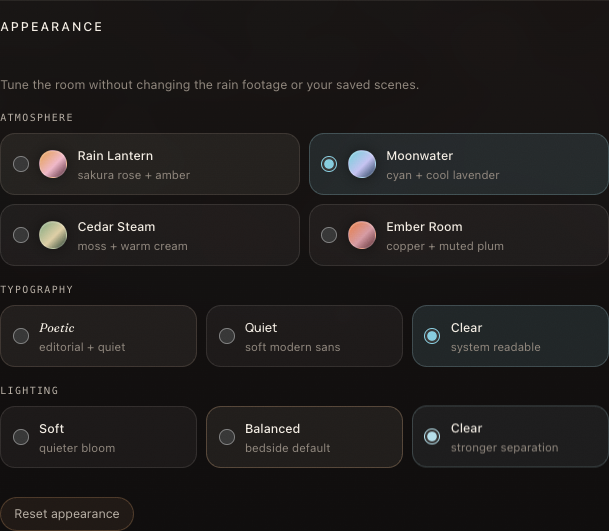

# Nocturne

Nocturne is a local-first bedside sound instrument: an eight-channel ambient
mixer, a moon-and-weather Sky, and a personal Radio that plays files from your
own machine. There is no account, cloud library, analytics service, or feed.

This repository contains a **field-test alpha**. The full profile passed its
owner acceptance run on macOS on August 1, 2026. It is not a medical product,
an alarm clock, or a promise that a phone browser will remain alive overnight.

[Download the current packages from GitHub Releases](https://github.com/CharlesMish/nocturne/releases).
Choose the standard Nocturne package for the animated presentation or Nocturne
Pi for the reduced-motion, static-media profile. Real Windows launch testing,
physical Raspberry Pi behavior and Pi 3 resource margin, screen-reader use,
phone lock/background return, extended overnight operation, listening comfort,
and manual loop audition across the full catalog remain pending field tests.

## A look inside Nocturne

The full Nocturne profile is one quiet instrument with three related rooms.
Onsen keeps the cinematic rain scene close to the shared master and timer rail.

[](docs/screenshots/onsen-rain-lantern.webp)

| Sky | Radio |
|:---:|:---:|
| [](docs/screenshots/sky-observing.webp) | [](docs/screenshots/radio-bedside-deck.webp) |
| Moon phase and a compact local observing card. | A warm local deck that waits for you to press play. |

<p align="center">
  <a href="docs/screenshots/appearance-room.png"></a>
</p>
<p align="center"><em>Room settings coordinate atmosphere, typography, and lighting in this browser without recoloring the rain footage.</em></p>

These are deterministic sample captures with no personal location or Radio
library. They show the full profile; [Nocturne Pi](docs/PROFILES.md) keeps its
reduced visual path and does not expose appearance controls.

<!-- NOCTURNE:BEGIN GENERATED BUILD ID -->
Current packaged alpha label:

```text
v0.1.0-alpha.13 · 2026-08-01 · 23ad7d7
```

To stamp another package from a Git checkout or source archive:

```bash
python scripts/stamp_build.py --version 0.1.0-alpha.13 --revision 23ad7d7
```
<!-- NOCTURNE:END GENERATED BUILD ID -->

## Two editions, one source tree

- **Nocturne** is the full atmospheric presentation. It is intended for
  Raspberry Pi 4 or newer, ordinary computers, and remote-browser use.
- **Nocturne Pi** uses a lower-resource profile: a still scene instead of the
  rain video, no continuous decorative motion or parallax, simpler compositing,
  and conservative loading. It is designed for Raspberry Pi 3-class and other
  constrained systems, especially when the Pi also runs the local display.

Nocturne Pi is a design target, not a claim that every Pi 3 configuration has
already been tested. Both editions retain the same mixer, audio catalog, local
scenes, Radio, privacy model, and accessibility intent. See
[Profiles](docs/PROFILES.md).

A Pi may either serve Nocturne to another device or serve **and** display it
locally. That is a deployment distinction, not another product edition.

## Hosted web edition

Hosted build and deployment tooling lives in [`web/`](web/). It stages the
shared UI in `static/`, the curated recorded catalog, and the repository's
credits and provenance into a Cloudflare Workers Static Assets bundle intended
for `nocturne.cmish.dev`. Local product ZIPs exclude the Node/Cloudflare tooling
and generated Worker output; the editable UI and public media remain shared
with the local and Pi profiles.

Use Node 22. To run the web edition locally:

```bash
cd web
npm ci
npm run build
npm run dev
```

Before proposing a hosted release, run the complete non-deploying check:

```bash
npm run check
```

That command runs the production build, built-asset verification, and a
Wrangler dry run. It does not place a version on production traffic.

For Cloudflare Workers Builds, use `web` as the root directory, `npm run build`
as the build command, `npm run deploy` for the production `main` branch, and
`npx wrangler versions upload` for non-production branches. Retrying a
historical build can retain that build's earlier command; a new `main` push uses
the current Build configuration.

The hosted edition preserves Nocturne's core rooms and interaction model:
Onsen, Sky, personal Radio, the eight-channel mixer and sleep timer, local
scenes, curated appearance, and all 11 bundled recorded CC0 sounds. Browser
adaptations keep personal Radio files in the current tab, store room and Sky
choices in that browser, and call Open-Meteo directly only after a location is
chosen.

The static Worker intentionally omits the 17 optional install-generated WAVs
and the server-only Utility and Dashboard. Those remain available in the local
Python-backed edition; quarantined audio remains absent everywhere public.
This is a documented deployment boundary, not a second hand-maintained UI.

## Quick start

Download the standard or Pi **product** ZIP rather than the optional evidence
archive, extract the entire ZIP into a writable folder, and run the commands
from that folder. Nocturne requires Python 3.10 or newer. The first install uses
the network to download Python packages; normal use does not contact a package
index.

Windows:

```text
Install Nocturne.bat
Start Nocturne.bat
```

macOS:

```text
Install Nocturne.command
```

Linux / Raspberry Pi:

```bash
./install.sh
./.venv/bin/python run_nocturne.py
```

After installation, the direct launch command on macOS or Linux is:

```bash
.venv/bin/python run_nocturne.py
```

The installer attempts 17 optional procedural beds at 60 seconds each. The
bundled curated Core Sound Pack works immediately if generation is skipped or
fails; use `python3 install.py --skip-noise` for the quickest constrained-device
install, or `python3 install.py --noise-seconds 180` to request longer beds.

Open the local URL printed after launch, then raise one mixer channel; browsers
wait for that first audio gesture. Press Ctrl+C in the launcher terminal to stop
Nocturne, and run the same start command to restart it.

Run the Pi profile explicitly:

```bash
./.venv/bin/python run_nocturne.py --profile nocturne-pi
```

For trusted-LAN access:

```bash
./.venv/bin/python run_nocturne.py --host 0.0.0.0 --port 8000
```

Then open `http://DEVICE-IP:8000/` from a device on the same trusted network,
replacing `DEVICE-IP` with the Nocturne host's LAN address. The ready message
prints a safe loopback URL for the host itself; it does not discover your LAN
address.
Ordinary LAN HTTP plays audio, but some browser integration requires localhost
or trusted HTTPS. See [Platform behavior](docs/PLATFORM_BEHAVIOR.md).

Nocturne has no login or per-user permissions. Anyone who can reach it on the
network can change settings and, when Utility is enabled, create, edit, or
delete local sketches. Use LAN access only on a network you trust.

Sky weather sends the configured coordinates, timezone, and temperature unit
to Open-Meteo; place search sends the text you explicitly search. Reachable LAN
clients can read the configured location/settings and Radio filenames, and can
request Radio audio bytes. Explicitly opening a Utility sketch in Strudel puts
that sketch code in a `strudel.cc` URL fragment. Nocturne itself has no account,
cloud library, analytics, or feed, and support reports remain local until you
choose to share them.

## What is here

- **Onsen:** the ambient mixer and rain scene.
- **Sky:** local weather plus a client-side moon phase visual.
- **Radio:** a local bedtime playlist with volume, warmth, drift, space, and
  shuffle controls.
- **Tonight:** eight bundled recorded CC0 sounds; generated beds are optional
  and Experimental sounds remain explicitly separated.
- **Local scenes:** up to 12 browser-local named mixes.
- **Curated appearance:** the full profile offers four coordinated color moods,
  three typography treatments, and three lighting densities, stored only in
  that browser. All bundled fonts are served locally.
- **Two presentation profiles:** selected without forking product behavior.
- **Offline loop preparation:** provenance-preserving crossfade tooling that
  never promotes a candidate without human audition.

Utility and Dashboard remain optional and hidden until enabled in Settings.

## Found something strange?

Reports from Raspberry Pi and ordinary computers are genuinely welcome—whether
something breaks, runs slowly, or works surprisingly well. You do not need to
be technical. A useful hardware report includes:

- device model and RAM;
- operating system and browser;
- Nocturne or Nocturne Pi;
- whether the host only served the page or also displayed it;
- what happened and how long it ran.

Use the GitHub issue templates or run:

```bash
python3 scripts/support_report.py
```

The report is created locally for review and is never uploaded automatically.
See [Hardware reports](docs/HARDWARE_REPORTS.md).

## Built with AI, directed with care

Nocturne has been developed through iterative collaboration with AI coding,
review, and design tools. It is not treated as disposable output: the human
owner directs the product, compares independent reviews, preserves evidence,
and invites real hardware and listening reports.

## Product and evidence are separate

The `main` branch stays focused on understanding, installing, running, and
contributing to the product. Detailed verification logs, retained media,
provenance screenshots, independent reviews, and historical handoffs belong in
the version-matched `evidence` branch and companion evidence archive.

This is an audience split, not a secrecy boundary. The retained rain-video
transform record lives at `retained/media/rain-transform.json` in the matching
evidence bundle. See [Repository surfaces](docs/REPOSITORY_SURFACES.md).

## Verification

Useful source checks:

```bash
.venv/bin/python scripts/sync_release_data.py --check
.venv/bin/python check_audio_contract.py --source
node scripts/release-audit.mjs --source
.venv/bin/python scripts/runtime_smoke.py
.venv/bin/python scripts/profile_smoke.py
.venv/bin/python scripts/installer_smoke.py
.venv/bin/python scripts/path_safety_smoke.py
.venv/bin/python scripts/release_builder_smoke.py
.venv/bin/python -m compileall -q .
```

The audit prints to stdout without creating a root report. Use
`--report verification-artifacts/release-audit.json` only when retaining an
artifact deliberately. GitHub Actions runs the deterministic source suite on
Python 3.10 and 3.12; browser smoke is isolated as QA-only because Playwright
and Chromium are not runtime dependencies. Run both profiles before a UI
release claim when Chromium is available, or record `NOT RUN` honestly.

These checks do not establish listening comfort, Pi 3 performance, real
screen-reader quality, phone lock-screen survival, battery/heat behavior, or an
overnight run. Those remain human and target-device tests.

## Documentation

- [Profiles](docs/PROFILES.md)
- [Hardware reports](docs/HARDWARE_REPORTS.md)
- [Field-test card](docs/FIELD_TEST_CARD.md)
- [Device test matrix](docs/DEVICE_TEST_MATRIX.md)
- [Platform behavior](docs/PLATFORM_BEHAVIOR.md)
- [Sound library](docs/SOUND_LIBRARY.md)
- [Media licenses](MEDIA_LICENSES.md)
- [Audio credits](AUDIO_CREDITS.md)

Detailed process history is intentionally absent from the front door.
